# HandyHub

## Projekti üldinfo

### Projekti nimi

HandyHub

### Projekti kirjeldus

HandyHub on mobiilirakendus, mis aitab kasutajatel leida erinevate valdkondade teenusepakkujaid ühest kohast.

Rakendus võimaldab sirvida spetsialistide profiile, vaadata nende teenuseid, hinnanguid ja arvustusi ning hallata kasutajakontot.

Projekt realiseeriti kahes erinevas tehnoloogias:

- Androidi native-rakendus, mis kasutab Kotlin'i ja Jetpack Compose'i;
- cross-platform mobiilirakendus, mis kasutab React Native'i ja Expo't.

Mõlemad versioonid kasutavad sama äriloogikat ja andmemudelit, kuid on realiseeritud erinevate mobiilirakenduste arendusraamistike abil.

### Meeskonna liikmed

- Jekaterina Shashkina — Android (Kotlin) versioon
- Nadežda Artamonova — React Native versioon

### Projekti eesmärk

Paljudel inimestel on keeruline leida sobivat teenusepakkujat ning võrrelda erinevaid spetsialiste. HandyHub eesmärk on koondada erinevate valdkondade meistrid ühte rakendusse, et kasutajad saaksid kiiresti leida vajaliku teenuse.

Rakendus on mõeldud:

- klientidele, kes otsivad teenusepakkujaid;
- spetsialistidele, kes soovivad oma teenuseid tutvustada;
- kasutajatele, kes soovivad võrrelda hindu, teenuseid ja hinnanguid.

## Repositooriumi struktuur

```text
HandyHub/
  kotlin-app/
  react-native-app/
  assets/
```

## Funktsionaalsus

Mõlemas rakenduse versioonis on realiseeritud järgmised võimalused:

- kasutaja registreerimine;
- sisselogimine ja väljalogimine;
- kasutajaprofiili vaatamine ja muutmine;
- avatari kasutamine;
- teenusekategooriate sirvimine;
- teenuste otsing;
- meistrite nimekirja vaatamine;
- meistrite profiilide vaatamine;
- teenuste vaatamine;
- arvustuste ja hinnangute vaatamine;
- arvustuste lisamine ja muutmine;
- meistriks registreerimine;
- teenuste lisamine ja muutmine;
- andmete salvestamine lokaalsesse SQLite andmebaasi.

### Olulisemad kasutusjuhtumid

1. Kasutaja avab rakenduse ja vaatab teenusepakkujaid.
2. Kasutaja registreerib konto.
3. Kasutaja logib rakendusse sisse.
4. Kasutaja vaatab kategooriaid.
5. Kasutaja avab meistri profiili.
6. Kasutaja vaatab meistri teenuseid.
7. Kasutaja muudab oma profiiliandmeid.
8. Kasutaja saab lisada arvustuse või registreerida ennast meistriks.

## Kasutatud Tehnoloogiad

### Android/Kotlin

- Kotlin
- Jetpack Compose
- Material Design 3
- Navigation Compose
- Room Database
- SQLite
- Kotlin Coroutines
- Android Studio

### React Native

- React Native
- Expo
- Expo Router
- TypeScript
- SQLite läbi expo-sqlite
- React Context
- expo-image-picker
- @expo/vector-icons

### Üldised tööriistad

- Git
- GitHub
- GitHub Pull Requests

## Andmete haldamine

Mõlemad rakenduse versioonid kasutavad lokaalset SQLite andmebaasi. Rakendus ei vaja töötamiseks serverit ega internetiühendust.

### Android / Kotlin

Android versioon kasutab andmete salvestamiseks Room Database teeki, mis töötab SQLite andmebaasi peal.

Andmekihis kasutatakse:

- Entity klasse;
- DAO liideseid;
- AppDatabase klassi;
- Repository kihti.

Andmed salvestatakse seadme lokaalsesse andmebaasi ning laaditakse rakenduse kasutamisel DAO ja Repository kaudu.

### React Native

React Native versioon kasutab lokaalset SQLite andmebaasi läbi expo-sqlite teegi.

Andmebaasis hoitakse:

- rolle;
- kasutajaid;
- kategooriaid;
- meistrite profiile;
- teenuseid;
- arvustusi.

Andmed laaditakse SQLite andmebaasist rakenduse käivitamisel. Kasutaja tegevuste korral uuendatakse rakenduse state ning muudatused salvestatakse lokaalsesse andmebaasi repository ja DAO kihtide kaudu.

## Andmemudel (ERD)

Mõlemad rakenduse versioonid kasutavad sama relatsioonilist andmemudelit.

Andmemudel kirjeldab rakenduse peamisi objekte ning nendevahelisi seoseid.

Peamised tabelid:

- Users
- Roles
- Categories
- MasterProfile
- Services
- Reviews

ERD diagramm:

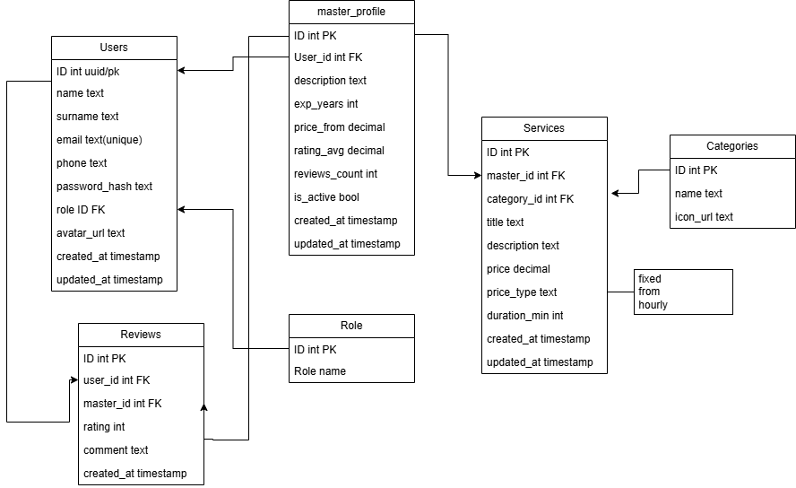

Peamised seosed:

- kasutaja kuulub ühte rolli;
- kasutaja võib omada meistri profiili;
- meistri profiil võib sisaldada mitut teenust;
- teenus kuulub kategooriasse;
- kasutajad saavad jätta hinnanguid ja arvustusi.

## Rakenduste arhitektuur

Projekt on jaotatud kihtideks, et eraldada kasutajaliides, äriloogika ja andmekiht.

### Android / Kotlin arhitektuur

```
UI (Jetpack Compose)
↓
ViewModel
↓
Repository
↓
DAO
↓
Room Database
↓
SQLite
```

#### UI Kiht

Jetpack Compose ekraanid:

```
app/src/main/java/com/example/handyhub/ui/screens/
  AddReviewScreen.kt
  BecomeMasterScreen.kt
  EditProfileScreen.kt
  HomeScreen.kt
  LoginScreen.kt
  MasterDetailScreen.kt
  MyServiceScreen.kt
  ProfileScreen.kt
  RegisterScreen.kt
  ServiceFormScreen.kt
```

Taaskasutatavad komponendid:

```
app/src/main/java/com/example/handyhub/ui/components/
  AppButton.kt
  AppExpandableCategories.kt
  AppHeader.kt
  AppSearchBar.kt
  AppTextField.kt
  CategoryDropdown.kt
  ConfirmDialog.kt
  MasterCard.kt
  MasterInfoCard.kt
  MasterProfileCard.kt
  MasterReviewSection.kt
  ProfileInfoCard.kt
  RatingBar.kt
  RatingInput.kt
  ReviewAccordeonCard.kt
  ServiceManageCard.kt
```

UI kiht vastutab ekraanide, vormide, nuppude, kaartide ja navigeerimise kuvamise eest.

#### ViewModel kiht

ViewModel kiht hoiab ekraanide olekut ja vahendab andmeid UI ning repository vahel.

```
app/src/main/java/com/example/handyhub/viewmodel/
  AuthViewModel.kt
  HomeViewModel.kt
  MasterDetailViewModel.kt
  MasterViewModel.kt
```

ViewModel kasutab repository meetodeid andmete laadimiseks, lisamiseks ja uuendamiseks.

#### Model kiht

Domeenimudelid ja andmebaasi entity-klassid asuvad mudelite kaustas.

```
app/src/main/java/com/example/handyhub/model/
  User.kt
  Role.kt
  Category.kt
  MasterProfile.kt
  Service.kt
  Review.kt
```

Need klassid kirjeldavad rakenduse põhiandmeid ja Room Database tabeleid.

#### Data / Database kiht

Room Database seadistus:

```
app/src/main/java/com/example/handyhub/data/local/
  AppDatabase.kt
```

`AppDatabase.kt` määrab andmebaasi entity-klassid ja DAO liidesed.

Rakenduse andmebaasis kasutatakse järgmisi entity-klasse:

- User;
- Role;
- Category;
- MasterProfile;
- Service;
- Review.

### DAO kiht

DAO-failid sisaldavad andmebaasipäringuid.

```
app/src/main/java/com/example/handyhub/data/local/
  UserDao.kt
  RoleDao.kt
  CategoryDao.kt
  MasterProfileDao.kt
  ServiceDao.kt
  ReviewDao.kt

```

DAO kiht vastutab andmete lugemise, lisamise, muutmise ja kustutamise eest Room Database kaudu.

#### Repository kiht

Repository koondab DAO päringud ühte kohta ja annab ViewModelile mugavad meetodid andmetega töötamiseks.

```
app/src/main/java/com/example/handyhub/data/repository
  HandyHubRepository.kt
```

#### Navigation kiht

Rakenduse navigeerimine on realiseeritud Navigation Compose abil.

```
app/src/main/java/com/example/handyhub/navigation/
  AppNavigation.kt
  Routes.kt
```

Navigation kiht määrab, kuidas kasutaja liigub sisselogimise, registreerimise, avalehe, profiili ja meistri detailvaate vahel.

### React Native arhitektuur

React Native versioonis on rakendus jagatud ekraanideks, komponentideks, domeeniloogikaks, repository kihiks ja SQLite andmekihiks.

```
UI
↓
React Context
↓
Use Cases
↓
Repository
↓
DAO
↓
SQLite
```

#### UI kiht

Expo Router ekraanid:

```
src/app/
  index.tsx
  login.tsx
  register.tsx
  profile.tsx
  edit-profile.tsx
  add-master.tsx
  edit-master-profile.tsx
  master/[id].tsx
```

Taaskasutatavad komponendid:

```
src/components/
  common/
  home/
  master/
  profile/
  register/
  login/
  add-master/
  master-profile/
```

Ühised komponendid:

- BackButton;
- PrimaryButton;
- FormTextInput;
- PasswordField;
- FormMessage;
- ScreenHeader;
- RatingStars;
- AvatarPicker

#### Models

Domeenimudelid on eraldi kaustas:

```
src/models/
  Category.ts
  MasterProfile.ts
  Review.ts
  Role.ts
  Service.ts
  User.ts
  index.ts
```

#### UI models ja mappers

UI-mudelid:

```
src/ui/models/
  MasterCardUiModel.ts
  MasterDetailsUiModel.ts
  UserReviewUiModel.ts
```

Domeeniandmete teisendamine UI-mudeliteks:

```src/ui/mappers/masterMappers.ts

```

#### Domain kiht

Äriloogika

```
src/domain/usecases/
  masterUseCases.ts
  reviewUseCases.ts
  serviceUseCases.ts
  userUseCases.ts
```

Valideerimine:

```
src/domain/validation/
  serviceValidation.ts
  userValidation.ts
```

Domain kiht sisaldab meistri loomise, arvustuste uuendamise, teenuste haldamise ja kasutaja uuendamise reegleid. See kiht ei sõltu rakenduse ekraanidest.

#### Data kiht

DAO-failid

```
src/data/local/
  categoryDao.ts
  masterProfileDao.ts
  reviewDao.ts
  roleDao.ts
  serviceDao.ts
  userDao.ts
```

Repository:

```
src/data/repository/repository.ts
```

DAO sisaldab SQL-päringuid. Repository annab state-kihile mugavad meetodid andmete laadimiseks ja salvestamiseks.

#### Database kiht

SQLite seadistus:

```
src/database/
  database.ts
  mappers.ts
  provider.ts
  schema.ts
```

- provider.ts avab SQLite andmebaasi;
- schema.ts sisaldab SQL-skeemi ja migratsioone;
- mappers.ts teisendab andmebaasi read TypeScripti mudeliteks;
- database.ts initsialiseerib andmebaasi ja seed-andmed.

#### State kiht

Globaalne state:

```
src/state/
  AppContext.tsx
  types.ts
```

## Rakenduse käivitamine

### Projekti allalaadimine

` git clone https://github.com/JekaterinaShashkina/HandyHub.git`

### Android / Kotlin versiooni käivitamine

#### Nõuded

Enne käivitamist peavad olema paigaldatud:

- Android Studio;
- Android SDK;
- Android Emulator või Android-seade;
- JDK 17 (või Android Studio poolt pakutav JDK).

#### Projekti avamine

1. Klooni repositoorium:
   `git clone https://github.com/JekaterinaShashkina/HandyHub.git`
2. Ava Android Studio.
3. Vali Open Project.
4. Ava Android projekti kaust.

#### Sõltuvuste laadimine

Android Studio laadib Gradle sõltuvused automaatselt.

Vajadusel käivita:

`./gradlew build`

või Windowsis:

`gradlew.bat build`

#### Rakenduse käivitamine

1. Käivita Android Emulator või ühenda Android telefon USB kaudu.
2. Luba telefonis USB Debugging (vajadusel).
3. Vajuta Android Studios nuppu Run.
4. Vali sihtseade.
5. Oota projekti kompileerimist ja rakenduse käivitumist.

#### Andmebaas

Rakendus kasutab lokaalset SQLite andmebaasi Room Database kaudu.

Andmebaas luuakse automaatselt rakenduse esmakordsel käivitamisel ning eraldi seadistamist ei vaja.

### React Native versiooni käivitamine

Mine React Native projekti kausta:

`cd react-native-app`

Paigalda sõltuvused:

`npm install`

Käivita Expo:

`npx expo start --go --clear`

LAN-režiimi jaoks:

`npx expo start --go --lan --clear`

React Native versiooni testitakse Expo Go abil Android või iOS seadmes. Web-režiimi ei kasutata, sest rakendus kasutab lokaalset native-andmehoidlat expo-sqlite kaudu.

TypeScripti kontroll:

`npx tsc --noEmit`

## Ekraanipildid

### React-Native

Ekraanipildid asuvad kaustas:
`assets/img/screens_react/`

Avaleht

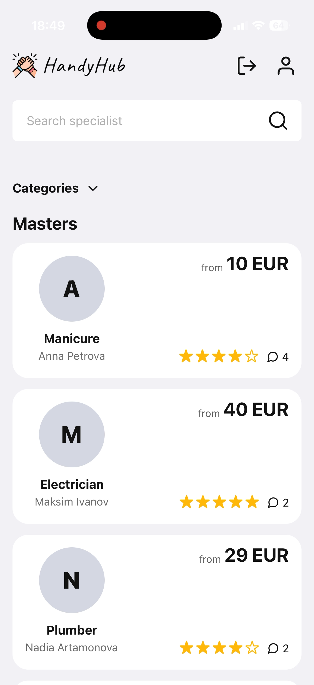

Kasutaja profiil ja registreerimine meistriks

<p >
  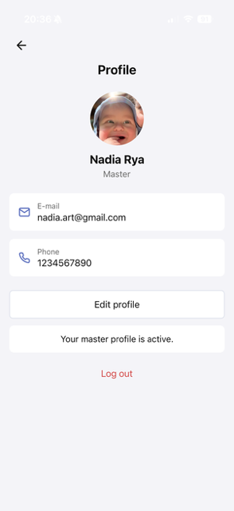
  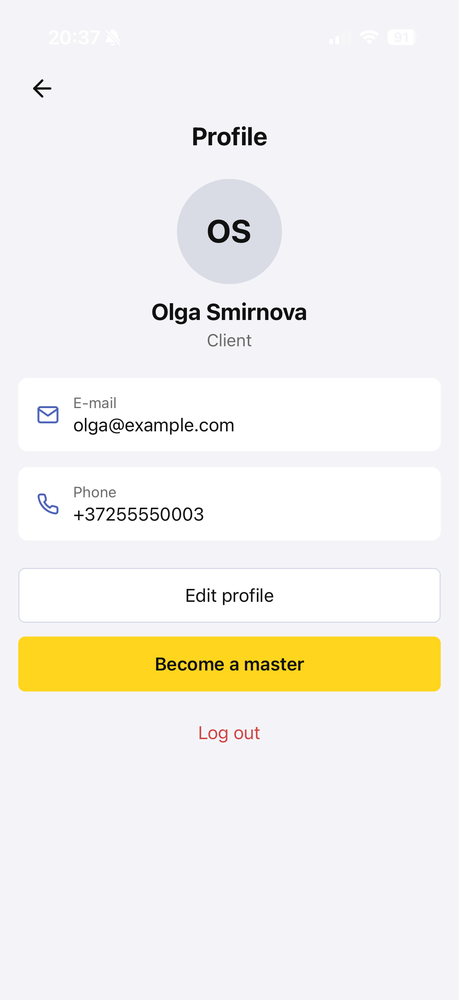
  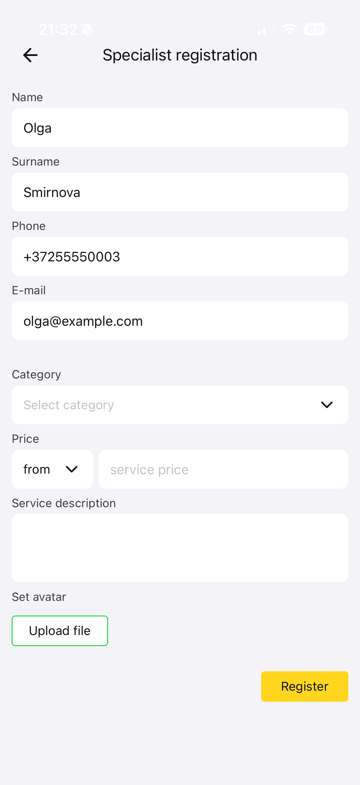
</p>

Meistri detailivaade ja teenuste ekraan

<p >
  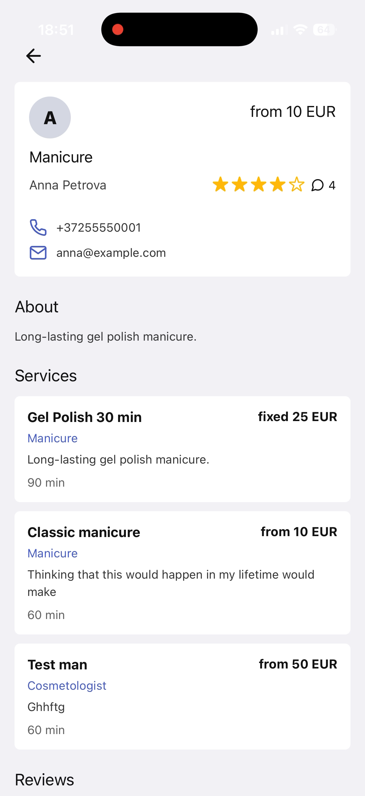
  
</p>

### Kotlin Android

Avaleht

<p >
  
  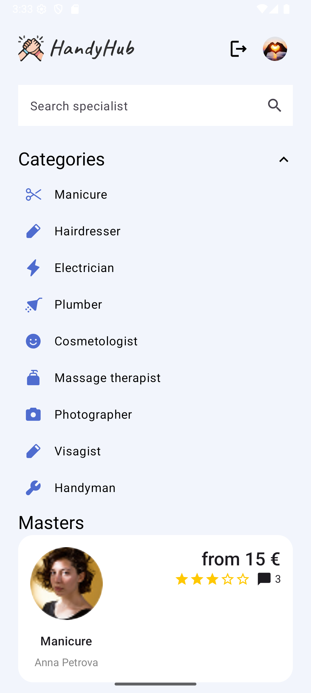
</p>

Kasutajaprofiil ja andmete muutmine

<p >
  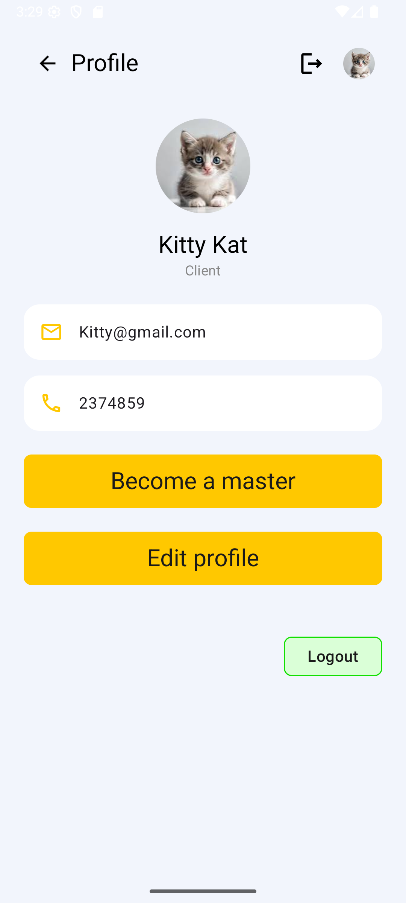
  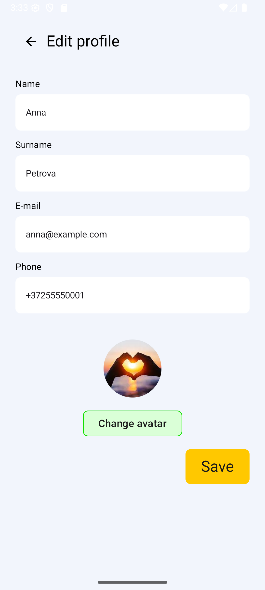
</p>

Meistri detailivaade ja teenuste ekraan

<p >
  
  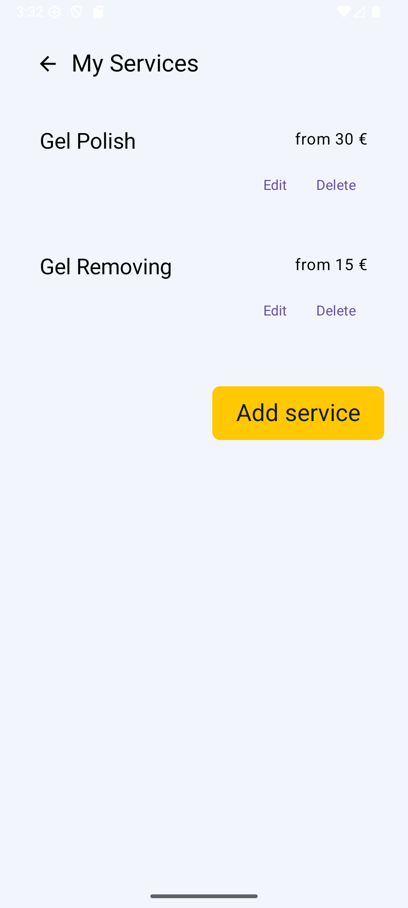
</p>

Kasutaja logini ja review lisamine

<p >
  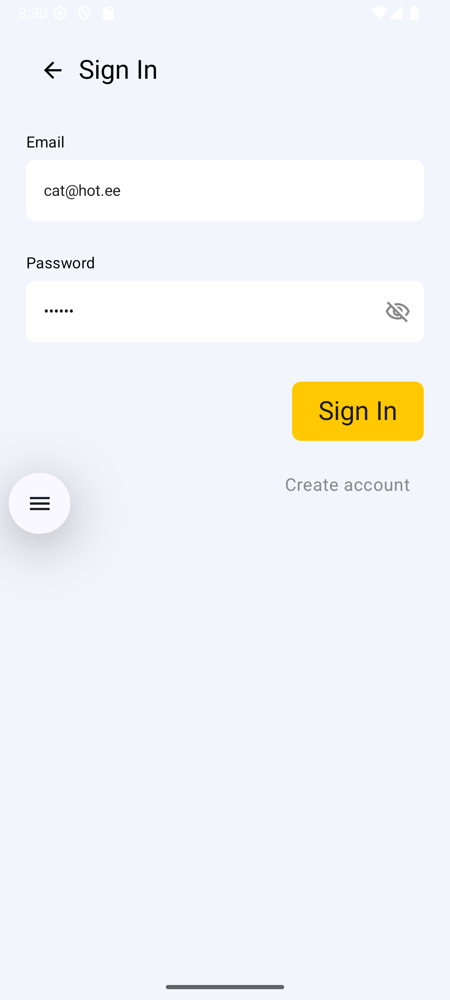
  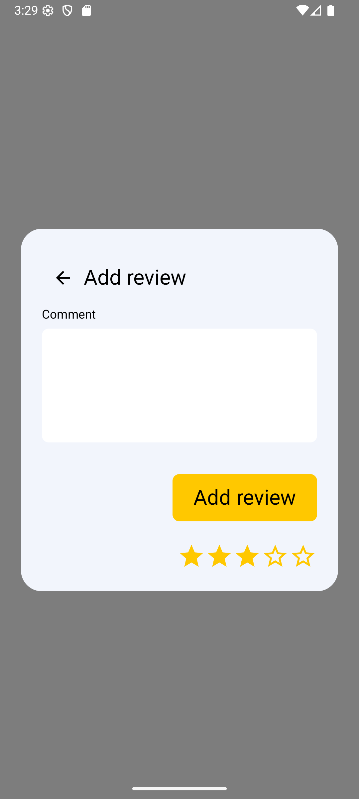
</p>

## Video demonstratsioon

### React Native versiooni video demonstratsioon:

[React Native video](https://www.youtube.com/shorts/uWRkQjBfEvg)

### Kotlin Android versioni video demonstratsioon:

[Kotlin Android video](https://youtu.be/tPYvXmmgI2k)

Videos näidatakse:

rakenduse põhifunktsionaalsust;
kasutajaliidest ja navigeerimist;
registreerimist ja sisselogimist;
andmete lisamist ja muutmist;
arvustustega töötamist;
meistri teenuste haldamist;

## Dokumentatsioon

React Native versiooni detailne dokumentatsioon asub siin:

[React Native README](react-native-app/README.md)

React Native README sisaldab projekti kirjeldust, funktsionaalsust, arhitektuuri, andmete haldamist, valideerimist, käivitamise juhendit, ekraanipilte, video demonstratsiooni ja AI kasutamise kirjeldust.

## AI kasutamine

Projekti arendamisel kasutati järgmisi AI tööriistu:

- ChatGPT
- Google Gemini
- Codex

### Milleks AI-d kasutati

**ChatGPT**

- koodi kirjutamise abistamiseks;
- Jetpack Compose ja React Native komponentide loomisel;
- Room Database ja SQLite kasutamise selgitamiseks;
- arhitektuuri ja dokumentatsiooni koostamisel;
- vigade analüüsimisel ja lahenduste leidmisel.

**Google Gemini**

- väiksemate programmeerimisvigade leidmiseks;
- koodifragmentide kontrollimiseks;
- süntaksi ja loogikavigade parandamiseks.

**Codex**

- projekti üldiseks ülevaatuseks;
- koodi kvaliteedi kontrollimiseks;
- README ja projekti struktuuri analüüsimiseks;
- võimalike probleemide leidmiseks enne esitamist.

### Iseseisvalt teostatud töö

Meeskonna poolt iseseisvalt tehti:

- projekti idee väljatöötamine;
- rakenduse funktsionaalsuse planeerimine;
- kasutajaliidese disain ja ekraanide ülesehitus;
- andmemudeli ja ERD diagrammi koostamine;
- SQLite andmebaasi struktuuri loomine;
- Room Database ja expo-sqlite integreerimine;
- rakenduse arhitektuuri kavandamine;
- navigeerimise realiseerimine;
- rakenduse testimine Android seadmetel;
- GitHubi kasutamine, branch'ide haldamine ja pull request'ide tegemine;
- video demonstratsioonide salvestamine;
- projekti lõplik dokumenteerimine.

## GitHubi kasutamine

Arenduse käigus kasutati GitHubi versioonihaldust:

- eraldi harusid uute funktsioonide jaoks;
- sisukaid commit message'eid;
- pull request'e muudatuste lisamiseks `main` harusse;
- regulaarset sünkroniseerimist `main` haruga;
- ühist repositooriumi mõlema rakenduse versiooni jaoks.

Selline töövoog võimaldas hoida Kotlin'i ja React Native'i osad ühes projektis, kuid arendada neid eraldi.
